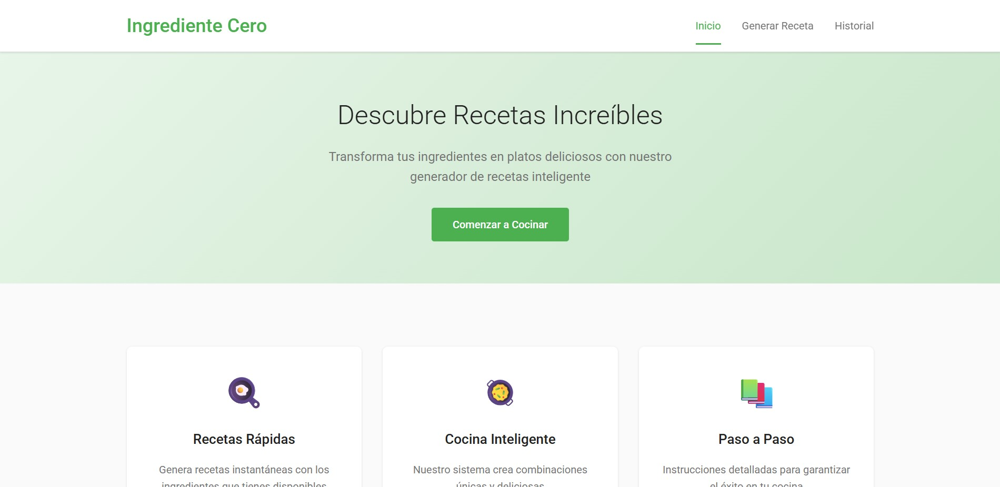
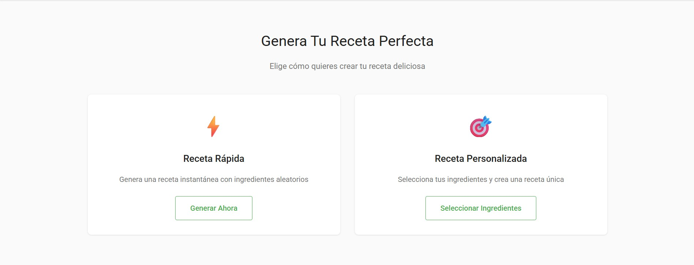

# 🍳 Ingrediente Cero - Generador de Recetas

Aplicación web interactiva para generar recetas personalizadas basadas en ingredientes disponibles.

## 📋 Descripción

**Ingrediente Cero** es un simulador de generación de recetas que permite a los usuarios:
- Generar recetas rápidas aleatorias
- Seleccionar ingredientes específicos para crear recetas personalizadas
- Guardar recetas favoritas
- Calificar recetas del 1 al 5 estrellas
- Ver estadísticas de uso
- Exportar e importar historial de recetas
- Funcionar en modo offline

## 🚀 Características

### ✨ Funcionalidades Principales
- **Generación Rápida**: Crea una receta aleatoria al instante
- **Selección Personalizada**: Elige hasta 5 ingredientes para tu receta
- **Sistema de Favoritos**: Marca tus recetas preferidas con ⭐
- **Calificación**: Puntúa tus recetas del 1 al 5 estrellas
- **Historial Completo**: Accede a todas tus recetas guardadas
- **Filtros Avanzados**: Busca por nombre, ingrediente, estilo o favoritos
- **Estadísticas**: Visualiza tus hábitos culinarios
- **Export/Import**: Respalda y restaura tus recetas en formato JSON
- **Modo Offline**: Funciona sin conexión a internet

### 🎯 Circuito Completo de Negocio

1. **Inicio**: El usuario ingresa a la aplicación
2. **Selección de Modo**: 
   - Modo Rápido: Genera receta automática
   - Modo Personalizado: Selecciona ingredientes
3. **Generación**: El sistema crea una receta con:
   - Nombre único
   - Lista de utensilios necesarios
   - Ingredientes detallados
   - Pasos de preparación completos
4. **Visualización**: Muestra la receta completa
5. **Interacción**:
   - Guardar en historial
   - Marcar como favorita
   - Calificar con estrellas
6. **Gestión**: 
   - Revisar historial
   - Filtrar y buscar recetas
   - Ver estadísticas
   - Exportar/Importar datos

### Capturas de pantalla




## 📂 Estructura del Proyecto
```
ingrediente-cero/
│
├── index.html                 # Página principal
├── README.md                  # Este archivo
├── sw.js                      # Service Worker para modo offline
│
├── pages/
│   ├── generar-receta.html   # Página de generación
│   └── historial.html        # Página de historial
│
├── css/
│   └── styles.css            # Estilos de la aplicación
│
├── js/
│   ├── data.js               # Carga de datos desde JSON
│   ├── storage.js            # Gestión de localStorage
│   ├── ui.js                 # Manejo de interfaz
│   ├── generator.js          # Lógica de generación
│   ├── history.js            # Lógica de historial
│   └── sw-register.js        # Registro del Service Worker
│
└── data/
    ├── ingredientes.json      # Base de datos de ingredientes
    ├── metodos.json          # Métodos de cocción
    ├── sabores.json          # Estilos culinarios
    └── recetas-completas.json # Recetas predefinidas
```

## 🛠️ Tecnologías Utilizadas

- **HTML5**: Estructura semántica
- **CSS3**: Estilos y animaciones
- **JavaScript ES6+**: Lógica de aplicación
- **Fetch API**: Carga de datos JSON
- **LocalStorage**: Persistencia de datos
- **Service Worker**: Funcionalidad offline
- **JSON**: Base de datos simulada

## 💾 Almacenamiento de Datos

La aplicación utiliza **localStorage** para:
- Historial de recetas generadas
- Lista de recetas favoritas
- Calificaciones de cada receta
- Sin límite de almacenamiento (depende del navegador)

## 📱 Instalación y Uso

### Requisitos
- Navegador web moderno (Chrome, Firefox, Safari, Edge, Opera, Brave)
- No requiere servidor web (funciona con file://)
- Recomendado: Usar servidor local para Service Worker

### Pasos para Ejecutar

1. **Descargar el proyecto**
```bash
   # Si tienes Git
   git clone [https://github.com/lucasDis/Coderhouse---Javascript]
   
   # O descargar ZIP y extraer
```

2. **Opción A: Abrir directamente**
   - Doble clic en `index.html`
   - Nota: Service Worker no funcionará con file://

3. **Opción B: Usar servidor local (Recomendado)**
```bash
   # Con Python 3
   python -m http.server 8000
   
   # Con Node.js (http-server)
   npx http-server
   
   # Con PHP
   php -S localhost:8000
```
   
   Luego abrir: `http://localhost:8000`

4. **Navegar**
   - Inicio: Información y acceso rápido
   - Generar Receta: Crear nuevas recetas
   - Historial: Ver recetas guardadas

## 🎮 Guía de Uso

### Generar Receta Rápida
1. Click en "Generar Receta" en el menú
2. Click en "Generar Ahora"
3. La receta se mostrará automáticamente
4. Click en "Guardar Receta" para añadir al historial
5. Califica con estrellas y marca como favorita

### Generar Receta Personalizada
1. Click en "Seleccionar Ingredientes"
2. Click en hasta 5 ingredientes de la lista
3. Click en "Terminar Selección"
4. Revisa tu receta personalizada
5. Guarda, califica y marca como favorita

### Gestionar Historial
1. Click en "Historial" en el menú
2. Usa los filtros para buscar:
   - Búsqueda por texto
   - Ordenar por fecha/nombre/calificación
   - Filtrar por estilo culinario
   - Mostrar solo favoritos
3. Click en una receta para ver detalles
4. Califica o marca/desmarca favoritos

### Ver Estadísticas
1. En Historial, click en "📊 Ver Estadísticas"
2. Revisa:
   - Total de recetas
   - Ingrediente más usado
   - Método favorito
   - Estilo preferido
   - Calificación promedio
   - Total de favoritos

### Exportar/Importar
- **Exportar**: Click en "💾 Exportar" → Se descarga JSON
- **Importar**: Click en "📥 Importar" → Selecciona archivo JSON

## 🔧 Características Técnicas

### Manejo de Errores
- Try-catch en todas las operaciones críticas
- Mensajes toast UX-friendly
- Validación de datos JSON importados
- Fallback para conexión offline

### Performance
- Carga asíncrona de datos JSON
- Event delegation para elementos dinámicos
- CSS optimizado con variables
- Animaciones con CSS en lugar de JS

### Accesibilidad
- Semantic HTML
- Labels en todos los inputs
- Contraste de colores adecuado
- Responsive design

## 📊 Datos Disponibles

- **97 Ingredientes**: Carnes, verduras, frutas, lácteos, granos, especias
- **14 Métodos de Cocción**: Horno, parrilla, salteado, etc.
- **15 Estilos Culinarios**: Mediterráneo, asiático, italiano, etc.
- **7 Recetas Completas Predefinidas**: Con pasos detallados

## 🌐 Modo Offline

La aplicación funciona completamente sin conexión:
1. Al cargar por primera vez, se cachean todos los recursos
2. Service Worker intercepta peticiones
3. Indicador visual cuando no hay conexión
4. LocalStorage mantiene todos los datos

## ⚠️ Limitaciones Conocidas

- No hay backend real (simulado con JSON)
- No hay autenticación de usuarios
- Límite de 5 ingredientes en modo personalizado
- Service Worker requiere HTTPS o localhost
- LocalStorage limitado por el navegador (~5-10MB)

## 🐛 Troubleshooting

**Problema**: Los datos no cargan
- **Solución**: Verifica que los archivos JSON estén en `/data/`
- Revisa la consola del navegador (F12)
- Asegúrate de usar servidor local si usas fetch

**Problema**: Service Worker no funciona
- **Solución**: Usa HTTPS o localhost (no file://)
- Limpia cache del navegador
- Verifica que sw.js esté en la raíz

**Problema**: No se guardan las recetas
- **Solución**: Verifica que localStorage esté habilitado
- Revisa modo privado/incognito del navegador
- Limpia localStorage y recarga

## 👨‍💻 Desarrollo

### Extender la Aplicación

**Agregar nuevos ingredientes**:
- Edita `data/ingredientes.json`
- Agrega strings al array

**Agregar recetas completas**:
- Edita `data/recetas-completas.json`
- Sigue la estructura existente

**Personalizar estilos**:
- Edita variables CSS en `:root` en `styles.css`

## 📄 Licencia

Proyecto educativo - Uso libre para fines de aprendizaje

## 🙏 Créditos

Desarrollado como proyecto para el curso de JavaScript de Coderhouse

---

**¿Preguntas o problemas?** Abre un issue en el repositorio o contacta al desarrollador.